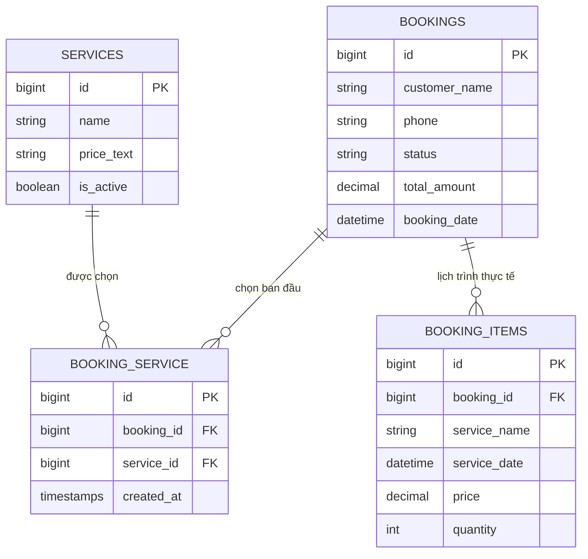

# ĐỀ XUẤT NÂNG CẤP KIẾN TRÚC QUAN HỆ DỊCH VỤ - ĐẶT LỊCH (SERVICE RELATIONSHIP MIGRATION PROPOSAL)
## Dự án: Makeup Artist Website

---

## 1. Hiện trạng Kiến trúc Hiện tại (Current State)

Trong giai đoạn phát triển trước đây:
- Bảng `bookings` ban đầu dùng cột `service_id` (foreign key trỏ tới `services.id`).
- Sau đó được nâng cấp sang cột `service_ids` (kiểu `JSON` lưu mảng các ID như `[1, 2]`) để khách hàng có thể chọn nhiều dịch vụ cùng lúc.
- Đồng thời bảng `booking_items` được tạo để lưu chi tiết các dịch vụ phụ trợ, ngày giờ thực hiện và giá thực tế sau khi admin tư vấn chốt đơn.

### Ưu điểm hiện tại:
- Nhanh gọn, đáp ứng ngay nhu cầu form đăng ký ngoài frontend.

### Nhược điểm & Hạn chế khi mở rộng lớn (Scalability & Integrity Drawbacks):
1. **Thiếu ràng buộc toàn vẹn dữ liệu ở mức Database (No Foreign Key Constraints)**:
   - Cột `JSON` không thể đặt foreign key constraint cấp RDBMS. Nếu một `Service` bị xóa cứng (`DELETE`), ID của nó vẫn còn nằm trong mảng `service_ids` của bảng `bookings`.
2. **Khó Query Thống Kê & Báo Cáo Phức Tạp**:
   - Khi muốn đếm số lượng booking theo từng dịch vụ, database phải dùng hàm JSON `JSON_CONTAINS` hoặc `json_overlaps`, hiệu năng chậm hơn nhiều so với JOIN trên bảng pivot có index.
3. **Trùng lặp mục đích với `booking_items`**:
   - `booking_items` và `service_ids` đang cùng phục vụ mục đích lưu danh sách dịch vụ của một booking.

---

## 2. Đề xuất Kiến trúc Chuẩn (Standard Normalized Architecture)

Đề xuất nâng cấp sang mô hình chuẩn **Many-to-Many Pivot Table** hoặc hợp nhất hoàn toàn vào **`booking_items`**:



---

## 3. Kế hoạch Chuyển Đổi An Toàn Không Mất Dữ Liệu (Zero-Data-Loss Migration Plan)

Khi chuyển đổi trong tương lai (Phase tiếp theo):

### Bước 1: Tạo bảng Pivot `booking_service`
```php
Schema::create('booking_service', function (Blueprint $table) {
    $table->id();
    $table->foreignId('booking_id')->constrained('bookings')->cascadeOnDelete();
    $table->foreignId('service_id')->constrained('services')->cascadeOnDelete();
    $table->timestamps();
    $table->unique(['booking_id', 'service_id']);
});
```

### Bước 2: Viết Migration Data Transfer
```php
$bookings = DB::table('bookings')->whereNotNull('service_ids')->get();
foreach ($bookings as $booking) {
    $serviceIds = json_decode($booking->service_ids, true);
    if (is_array($serviceIds)) {
        foreach ($serviceIds as $serviceId) {
            if (DB::table('services')->where('id', $serviceId)->exists()) {
                DB::table('booking_service')->insertOrIgnore([
                    'booking_id' => $booking->id,
                    'service_id' => $serviceId,
                    'created_at' => now(),
                    'updated_at' => now(),
                ]);
            }
        }
    }
}
```

### Bước 3: Cập nhật Eloquent Relation trong Model `Booking` & `Service`
```php
// Booking.php
public function services(): BelongsToMany
{
    return $this->belongsToMany(Service::class, 'booking_service');
}

// Service.php
public function bookings(): BelongsToMany
{
    return $this->belongsToMany(Booking::class, 'booking_service');
}
```

### Bước 4: Cập nhật `BookingResource.php` trong Filament
Sử dụng `Select::make('services')->relationship('services', 'name')->multiple()->preload()` thay thế cho `service_ids`.

---

## 4. Đánh giá Tác động & Khuyến nghị

- **Tác động**: Không ảnh hưởng đến luồng người dùng bên ngoài, tăng tính chặt chẽ của database và mở rộng báo cáo doanh thu theo dịch vụ cực kỳ chính xác.
- **Thời điểm thực hiện**: Khuyến nghị thực hiện ở phiên bản kế tiếp khi bắt đầu xây dựng tính năng báo cáo nâng cao hoặc phân hệ nhân sự.
